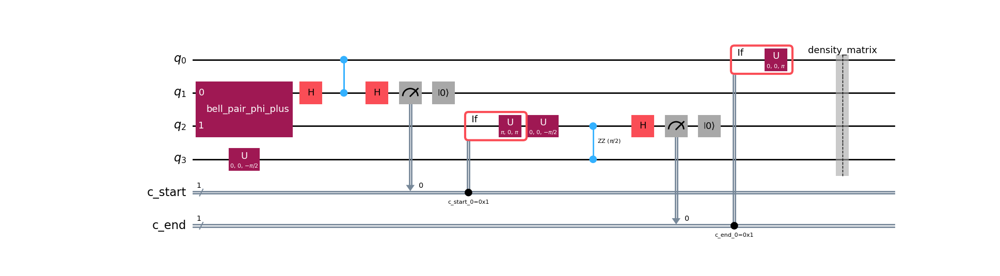
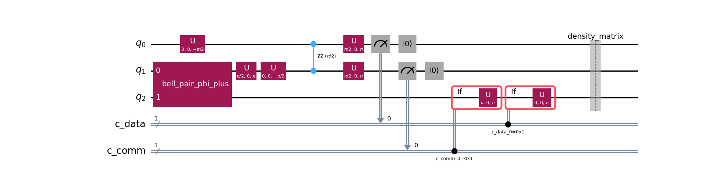

# hypergraph-partitioner

`hypergraph-partitioner` partitions quantum circuits into segments, partitions each segment across `k` blocks with KaHyPar, and returns an annotated intermediate representation that marks:

- local operations,
- nonlocal `CZ` gates inside segments (`telegate`-style annotations),
- qubit moves across segment boundaries (`teledata`-style annotations).

The repo is a Python modernization of the partitioning logic from the original Haskell `Distributed` project, adapted to work with `bosonic_model` circuits and a Qiskit-based preprocessing pipeline.

## What the Repo Does

The main entrypoint is `partition_circuit(...)`.

Given a `bosonic_model.Circuit`, it:

1. normalizes the circuit to one-qubit gates plus `CZ`,
2. pushes `CZ` gates earlier where legal,
3. builds a hypergraph from multi-qubit interactions,
4. partitions initial segments with KaHyPar,
5. merges adjacent segments using seam heuristics and `max_hedge_dist`,
6. returns a `PartitionedCircuit` with explicit annotations.

The public output is an annotated IR, not a fully lowered distributed circuit.

## Current Output Model

The public API returns a [`PartitionedCircuit`](/Users/elieben-shlomo/Code/projects/dqc-community/hypergraph-partitioner/src/hypergraph_partitioner/models/annotated.py) containing:

- `segments`
- `boundaries`
- `operations`

The `operations` stream contains:

- `LocalOp`
- `NonlocalCZOp`
- `BoundaryTeleportOp`

This means the repo currently answers:

- which operations stay local,
- which `CZ`s are remote inside a segment,
- which wires need to move between segments.

It does not yet lower those annotations into a concrete distributed execution circuit in production code.

## What Is Implemented

- `bosonic_model` circuit support
- OpenQASM 2 input via `bosonic_model.qasm.Translator`
- Qiskit-based normalization to one-qubit gates plus `CZ`
- `CZ` commutation / early-push preprocessing
- explicit hypergraph model with `WireVertex` and `InteractionVertex`
- KaHyPar partitioning
- initial segmentation
- seam merge heuristics
- restored `max_hedge_dist` influence on segmentation
- annotated output for telegate / teledata
- end-to-end tests for multi-segment behavior
- Aer-verified protocol tests for candidate telegate and teledata lowerings

## What Is Not Implemented Yet

The repo does not yet provide a production lowering pass such as:

- `lower_partitioned_circuit(...)`

There is currently no production code that turns:

- `NonlocalCZOp`
- `BoundaryTeleportOp`

into explicit protocol operations such as:

- Bell-pair preparation,
- measurement and reset,
- classically controlled corrections,
- logical wire relocation.

That logic now lives in the production helper module [lowering.py](/Users/elieben-shlomo/Code/projects/dqc-community/hypergraph-partitioner/src/hypergraph_partitioner/lowering.py) and is validated in tests, but it is not yet wired into a public lowering API.

## Lowering

This repo does not yet expose a production `lower_partitioned_circuit(...)` API, but it does contain Aer-verified candidate lowering patterns for the two important annotation types:

- `telegate`: remote `CZ` inside a segment
- `teledata`: qubit state teleportation across a segment boundary

Those candidate lowerings live in [lowering.py](/Users/elieben-shlomo/Code/projects/dqc-community/hypergraph-partitioner/src/hypergraph_partitioner/lowering.py). The fidelity checks and Qiskit/Aer verification live in:

- [test_telegate_teledata.py](/Users/elieben-shlomo/Code/projects/dqc-community/hypergraph-partitioner/tests/unit/test_telegate_teledata.py)
- [test_telegate_teledata_qiskit.py](/Users/elieben-shlomo/Code/projects/dqc-community/hypergraph-partitioner/tests/unit/test_telegate_teledata_qiskit.py)

Both are validated against ideal circuits with Aer density-matrix simulation:

- telegate checks that the reduced logical two-qubit state matches ideal `CZ`
- teledata checks that the destination qubit ends in the same state as the original source qubit

The tests also render `mpl` diagrams to `.pytest_artifacts/`.

Generate the diagrams locally with:

```bash
uv run pytest tests/unit/test_telegate_teledata.py tests/unit/test_telegate_teledata_qiskit.py -q
```

### Telegate Lowering

Candidate remote-`CZ` lowering:

- Bell-pair primitive
- local `u` / `rzz` gates
- measurement + reset
- LOCC corrections

Diagram:



### Teledata Lowering

Candidate state-teleportation lowering:

- Bell-pair primitive
- Bell-basis interaction on the source side
- measurement + reset
- LOCC corrections on the destination side

Diagram:



## Installation

This repo is set up to work with `uv`.

From the repo root:

```bash
uv sync --extra dev
```

This installs:

- the package itself,
- dev dependencies such as `pytest`,
- local path dependencies declared in `pyproject.toml`:
  - `bosonic-model`
  - `bosonic-converters`

Notes:

- KaHyPar is required for the partitioning pipeline.
- The repo currently expects the local sibling `dqcomp` checkout because of the path-based dependencies in `pyproject.toml`.

## Running Tests

Run the full test suite:

```bash
make test
```

Equivalent command:

```bash
uv run --extra dev python -m pytest -q
```

Run one focused test file:

```bash
uv run pytest tests/unit/test_telegate_teledata.py tests/unit/test_telegate_teledata_qiskit.py -q
```

Run one integration test file:

```bash
uv run pytest tests/integration/test_max_hedge_dist_regression.py -q
```

## Running Examples

Run all example scripts:

```bash
make run
```

This executes every `examples/*.py` file.

Run a single example directly:

```bash
uv run python examples/basic_partition_stats.py
```

Useful examples:

- `examples/basic_partition_stats.py`
  - minimal library usage
- `examples/contrived_two_phase_four_qubit_segments.py`
  - deterministic multi-segment example with visible seam/merge behavior
- `examples/search_two_segment_circuit.py`
  - deterministic search for circuits that survive as multiple final segments

Example with extra search budget:

```bash
uv run python examples/search_two_segment_circuit.py --max-candidates 1000
```

## Minimal Usage

```python
from bosonic_model.qasm import Translator

from hypergraph_partitioner import (
    count_interactions,
    count_nonlocal_interactions,
    count_teleports,
    partition_circuit,
)
from hypergraph_partitioner.config import KAHYPAR_CONFIG

qasm_text = """
OPENQASM 2.0;
include "qelib1.inc";
qreg q[4];
cz q[0], q[1];
cz q[2], q[3];
cz q[0], q[3];
"""

circuit = Translator().from_qasm(qasm_text)

result = partition_circuit(
    circuit,
    k=2,
    init_seg_size=10,
    max_hedge_dist=100,
    config_path=KAHYPAR_CONFIG,
)

print(result)
print(count_interactions(circuit.instructions))
print(count_nonlocal_interactions(result))
print(count_teleports(result))
```

## Public API

The package exports:

- `partition_circuit`
- `count_interactions`
- `count_nonlocal_interactions`
- `count_teleports`
- `PartitionedCircuit`
- `PartitionedSegment`
- `SegmentBoundary`
- `TeleportBoundary`
- `AnnotatedOp`
- `LocalOp`
- `NonlocalCZOp`
- `BoundaryTeleportOp`

See [__init__.py](/Users/elieben-shlomo/Code/projects/dqc-community/hypergraph-partitioner/src/hypergraph_partitioner/__init__.py).

## Important Notes

- `partition_circuit(...)` currently returns annotations, not a lowered distributed circuit.
- `max_hedge_dist` affects seam scoring / segmentation behavior, not the KaHyPar netlist directly.
- The production helper module [lowering.py](/Users/elieben-shlomo/Code/projects/dqc-community/hypergraph-partitioner/src/hypergraph_partitioner/lowering.py) contains candidate protocol builders for:
  - remote `CZ` (`telegate`)
  - qubit state teleportation (`teledata`)
- The tests [test_telegate_teledata.py](/Users/elieben-shlomo/Code/projects/dqc-community/hypergraph-partitioner/tests/unit/test_telegate_teledata.py) and [test_telegate_teledata_qiskit.py](/Users/elieben-shlomo/Code/projects/dqc-community/hypergraph-partitioner/tests/unit/test_telegate_teledata_qiskit.py) verify those lowerings with Aer.
- The generated protocol diagrams are written to `.pytest_artifacts/` during those tests.

## Repo Layout

Key files:

- [src/hypergraph_partitioner/bosonic_pipeline.py](/Users/elieben-shlomo/Code/projects/dqc-community/hypergraph-partitioner/src/hypergraph_partitioner/bosonic_pipeline.py)
  - main pipeline and annotation logic
- [src/hypergraph_partitioner/partitioner.py](/Users/elieben-shlomo/Code/projects/dqc-community/hypergraph-partitioner/src/hypergraph_partitioner/partitioner.py)
  - segmentation, seam scoring, and merge logic
- [src/hypergraph_partitioner/hgraph_builder.py](/Users/elieben-shlomo/Code/projects/dqc-community/hypergraph-partitioner/src/hypergraph_partitioner/hgraph_builder.py)
  - cut counting and KaHyPar conversion helpers
- [src/hypergraph_partitioner/models/hypergraph.py](/Users/elieben-shlomo/Code/projects/dqc-community/hypergraph-partitioner/src/hypergraph_partitioner/models/hypergraph.py)
  - explicit hypergraph data model
- [src/hypergraph_partitioner/models/annotated.py](/Users/elieben-shlomo/Code/projects/dqc-community/hypergraph-partitioner/src/hypergraph_partitioner/models/annotated.py)
  - public annotated IR
- [src/hypergraph_partitioner/lowering.py](/Users/elieben-shlomo/Code/projects/dqc-community/hypergraph-partitioner/src/hypergraph_partitioner/lowering.py)
  - candidate telegate / teledata protocol builders
- [tests/unit/test_telegate_teledata.py](/Users/elieben-shlomo/Code/projects/dqc-community/hypergraph-partitioner/tests/unit/test_telegate_teledata.py)
  - DSL-to-Qiskit Aer verification for production lowering helpers
- [tests/unit/test_telegate_teledata_qiskit.py](/Users/elieben-shlomo/Code/projects/dqc-community/hypergraph-partitioner/tests/unit/test_telegate_teledata_qiskit.py)
  - Qiskit-native protocol reference tests and diagram generation

## Current Status

This repo is currently best thought of as:

- a partitioning engine,
- an annotation engine for remote work,
- and a place where candidate lowering semantics are being validated.

It is not yet a full distributed-circuit synthesis library in production code.
